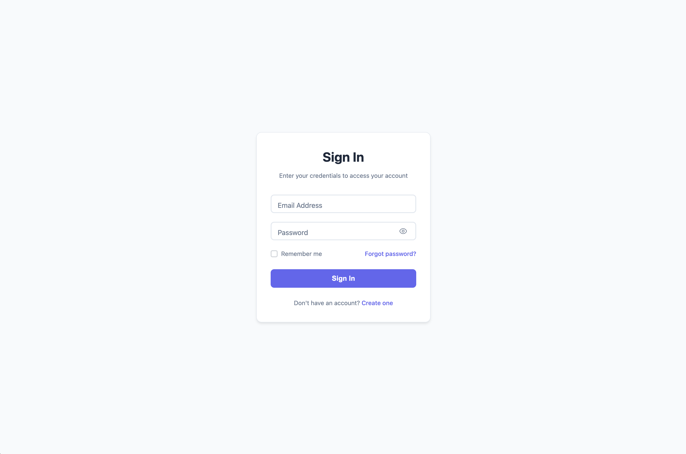

# Basic Login Form



A clean, simple, and functional login form that follows modern web standards. Perfect for quick implementation or as a starting point for customization.

## ✨ Features

- **Clean Design** - Minimal and professional appearance
- **Floating Labels** - Smooth label animations for better UX
- **Password Toggle** - Show/hide password functionality
- **Form Validation** - Real-time email and password validation
- **Loading States** - Visual feedback during submission
- **Success Animation** - Confirmation when login succeeds
- **Responsive Design** - Works perfectly on all devices
- **Accessibility** - ARIA labels and keyboard navigation
- **No Dependencies** - Pure HTML, CSS, and JavaScript

## 🎨 Design Features

- System font stack for native feel
- Subtle shadows and borders
- Clean color palette (#6366f1 primary)
- Smooth transitions and micro-interactions
- Mobile-first responsive design

## 📱 Browser Support

- Chrome 88+
- Firefox 103+
- Safari 15.4+
- Edge 88+

## 🔧 Technical Details

### Files Structure
```
basic/
├── index.html          # Main form structure
├── style.css           # Complete styling
├── script.js           # Form functionality
└── README.md           # This documentation
```

### Dependencies
- `../../shared/js/form-utils.js` - Shared validation and utilities

## 🚀 Usage

### Quick Start
1. Copy the entire `basic/` folder to your project
2. Copy `shared/js/form-utils.js` for full functionality
3. Open `index.html` in your browser or serve via HTTP

### Integration
```html
<!-- Include in your HTML -->
<link rel="stylesheet" href="path/to/basic/style.css">
<script src="path/to/shared/js/form-utils.js"></script>
<script src="path/to/basic/script.js"></script>
```

## ⚙️ Customization

### Colors
Modify the main colors in `style.css`:
```css
/* Primary color (buttons, links, focus states) */
#6366f1 → Your brand color

/* Background colors */
#f8fafc → Your background
white → Your card background

/* Text colors */
#1e293b → Your primary text
#64748b → Your secondary text
```

### Typography
The form uses system fonts by default. To use custom fonts:
```css
body {
    font-family: 'Your Font', -apple-system, BlinkMacSystemFont, ...;
}
```

### Form Behavior
Customize validation and submission in `script.js`:
```javascript
// Modify validation rules
FormUtils.validateEmail(value)
FormUtils.validatePassword(value)

// Customize login simulation
FormUtils.simulateLogin(email, password)
```

## 🎯 Form Fields

### Email Validation
- Required field
- Valid email format check
- Real-time validation feedback

### Password Requirements
- Minimum 8 characters
- Must contain uppercase, lowercase, and number
- Toggle visibility with eye icon

### Additional Features
- Remember me checkbox
- Forgot password link
- Account creation link

## 📋 Demo Credentials

For testing the demo functionality:
- **Successful login**: Any valid email + any password meeting requirements
- **Failed login**: `admin@demo.com` + `wrongpassword`

## 🔒 Security Notes

This is a frontend demo form. For production use:
- Implement proper backend authentication
- Use HTTPS for all login forms
- Add CSRF protection
- Implement rate limiting
- Use secure session management

## 📄 License

Part of the Modern Login Forms collection by [Aigars Silkalns](https://github.com/puikinsh/) for [Colorlib](https://colorlib.com).