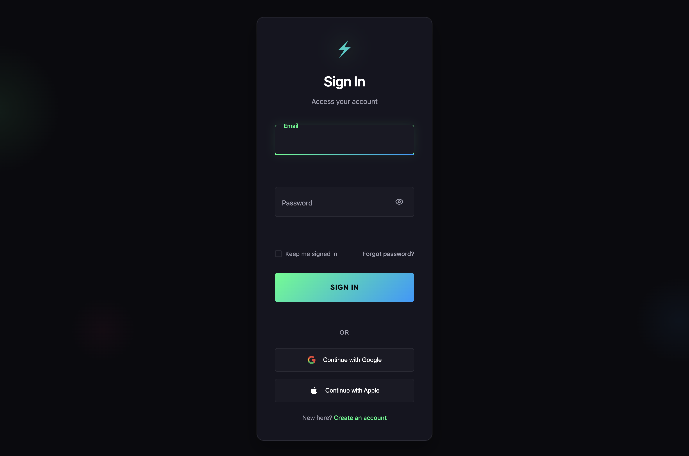

# Neon Minimalist Login Form

*Created by [Aigars Silkalns](https://github.com/puikinsh/) for [Colorlib](https://colorlib.com)*

A sleek dark-themed login form with neon green accents and animated background effects.

## Features

- **Dark Theme**: Modern dark background with neon accents
- **Animated Background**: Floating orbs with parallax mouse movement
- **Neon Effects**: Glowing borders and pulsing animations
- **Minimalist Design**: Clean, focused interface
- **Interactive Elements**: Hover effects and micro-interactions
- **Form Validation**: Real-time validation with neon error states
- **Social Login**: Google and Apple integration ready
- **Responsive**: Optimized for all devices

## Files

- `index.html` - Main form HTML structure
- `style.css` - Complete self-contained CSS with neon styles and animations
- `script.js` - Form functionality and neon effects

## Dependencies

- `../../shared/js/form-utils.js` - Shared form utilities (validation, animations)

## Usage

1. Copy the entire `neon/` folder to your project
2. The form is completely self-contained with all CSS included
3. Only dependency is the shared JavaScript utilities
4. Customize neon colors by modifying the CSS variables in `style.css`
5. Integrate with your authentication system

## Customization

Key CSS variables to customize:
- `--neon-primary`: Main neon color (#00ff88)
- `--neon-secondary`: Secondary neon color (#0099ff)
- `--neon-accent`: Accent color for errors (#ff0080)
- `--dark-bg`: Background color
- `--dark-card`: Card background color

## Performance Notes

- Uses CSS animations for smooth performance
- Background effects are optimized for 60fps
- Minimal JavaScript footprint
- No external dependencies

## Browser Support

- Chrome 88+
- Firefox 103+
- Safari 15.4+
- Edge 88+

Best experienced on modern browsers with hardware acceleration.

## Credits

Created by [Aigars Silkalns](https://github.com/puikinsh/) for [Colorlib](https://colorlib.com).